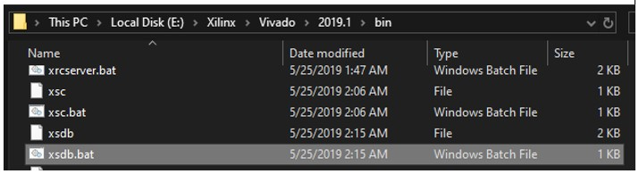
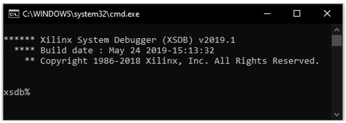
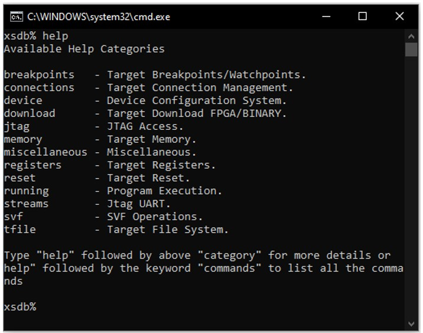
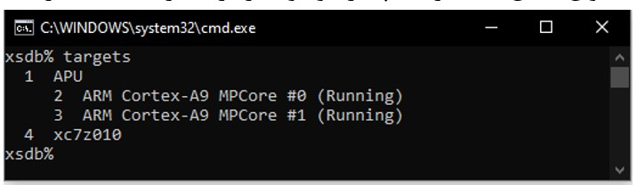
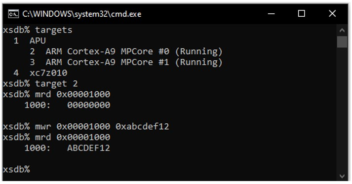

## Introduction to the Xilinx System Debugger (XSDB) Tool

This tool can be used to check the hardware connection between the board and the computer. To run this tool, as shown in the displayed path, we execute the `xsdb.bat` file.



Then, in the opened window, the desired command can be entered.



By entering the `help` command, access to the guide for other commands is provided.



One of the capabilities of this tool is reading from and writing to the on-chip memory (**OCM**). First, after connecting the board to the computer through the **JTAG** port, it is necessary to enter the `connect` command so that communication between the computer and the board is established. Then, by entering the `targets` command, the programmable elements available on the chip can be observed.



According to the figure above, it can be seen that two ARM processors and one FPGA have been recognized, which matches the chip used in this project (**Zynq7010**). To connect to one of the displayed units, for example to the first processor, the `target` command can be used as shown below.

```bash
xsdb% target 2
```

To read from a location in the on-chip memory, the `mrd` command is used as follows.

```bash
xsdb% mrd address
```

Also, to write to a memory location, the `mwr` command is used.

```bash
xsdb% mwr address value
```

The results of the above operations can be seen in the following figure.



According to the results, it can be observed that at address `0x00001000`, the initial value is `0x00000000`. After writing the value `0xabcdef12` to the same address and reading it again, it can be seen that the value change was successful.
